# NHANES Inferential-Stats
## Project

Google Colab based Python project to exlore using statistical tools the relationship between various variables (demographic, behavioral, and health variables) from  National Health and Nutrition Examination Survey (NHANES) datasets. 

Steps
  
 

1. **Data loading and preperation**
    - Data was loaded, prepared (renamed, merged, etc.), explored and analysed using
      - Python 
      - Python & R, and 
      - R 
    - Various statistical tools were used for analysies

2. **Downloading NHANES Files**
    - Three Methods to Run the Report
      - **Automated Script Download**
        - Runtime: Python
        - Use a Python script to download the .xpt files into specified folders, followed by converting these files to CSV format within Python (not R)
        - Full Code done: Setup, download, exploration, cleaning and transformation done
      - **Direct URL Download with R**
        - Runtime: R & Python
        - Download the .xpt files directly inside the R notebook by providing their web URLs, then process the data using Python.
        - Only setup and download demonstrated
      - **Accessing via URL in R**
        - Runtime: R
        - Use R to directly access the .xpt files online through their URLs, eliminating the need to download them locally.
        - Setup, cleaning, download and analysis demonstrated

3. **NHANES variables for analysis**

    - Marital Status (DMDMARTZ) - categorical, needs recoding (married or not married).
    - Education Level (DMDEDUC2) - categorical, needs recoding (bachelor’s or higher vs. less than bachelor’s).
    - Age in Years (RIDAGEYR) - continuous.
    - Systolic Blood Pressure (BPXOSY3) - continuous.
    - Diastolic Blood Pressure (BPXODI3) - continuous.
    - Vitamin D Lab Interpretation (LBDVD2LC) - categorical, two levels.
    - Hepatitis B Lab Antibodies (LBXHBS) - categorical, needs recoding to two levels.
    - Weak/Failing Kidneys (KIQ022) - categorical, can be treated as two levels.
    - Minutes of Sedentary Behavior (PAD680) - continuous, needs cleaning (remove values 7777, 9999, and null).
    - Current Self-Reported Weight (WHD020) - continuous, needs cleaning (remove values 7777, 9999, and null).

4. **Transformations & Analysis**  
    
    - Follow the instructions within the notebook (.ipynb) to download, rename, save and process NHANES datasets.
    
    - Execute each file sequenced in the notebook to clean, combine, and analyze the data.
      - Clean and recode (to map lists) variables (Columns and values) before performing analyses
      - Statistical tests are chosen according to research inquiry and data types.
    
        (Categorical variables)
        - Check and rename all columns of the datasets. 
        - Document frequency counts to confirm data consistency.

        (Continuous variables)
        - Check for placeholder values (7777, 9999) 
          -  Did not remove 7777, 9999, and null to see the full dataset character and visualizations; eg, in the dataset, when many more do not respond to a question, it tells a lot about the result. 
        - Handle as appropriate (e.g., by removing or imputing)

5. **Visualizations**
    - Check the results and visualizations to interpret patterns and insights in the .ipynb file. 

6. **Notebook**
    - Code, results, and explanations are documented in the Notebook.

7. **Brief summaries included below**
  

## Reproducibility

- Follow the flow in the .ipynb notebook
- Follow the folder structure
  - Files are downloaded from NHANES website links (included in Part 1: Python code)

## Analyses

1. Marital Status & Education Level
  
 

*Note: Location in .ipynb file: `In [19]:`*

**Is there an association between marital status (married or not married) and education level (bachelor’s degree or higher vs. less than a bachelor’s degree)?**

`YES - Positive association` (in the sample data)

Variables explored: 
- `DMDMARTZ` (Marital Status)
- `DMDEDUC2` (Education Level) 

 

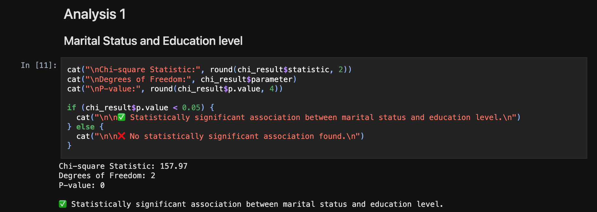

 

*Chi-square statistic* is a measure that assesses how well observed data fit the expected outcome. 
    157.97 indicates that there is a significant difference b/w the expected frequencies and the observed frequencies in the 2 categories, marital status and edu level.
    157.97 chi-sq stastistic suggests that these 2 variables are likely not independent, and that there is some association b/w them. There is a statistically significant association b/w them, and the null hypothesis, that there is no association b/w the 2 is rejected.

*Degrees of freedom* refers to the # of independent values that can vary in a statistical calculation. 
    This value is critical for determining the critical value of the chi-square statistic from the chi-square distribution table

*P-value* is a statistical measure that helps determine the significance of the results obtained from a hypothesis test. 
    It indicates the probability of observing the test results, or more extreme results, assuming the null hypothesis is true.
        A low p-value (typically < 0.05) suggests that the observed data (results) are statistically significant, suggesting strong evidence against the null hypothesis: the null hypothesis is                       rejected.
        A high p-value (typically > .05) suggests that the results are not statistically significant, indicating insufficient evidence to reject the null hypothesis.

Visualization

 

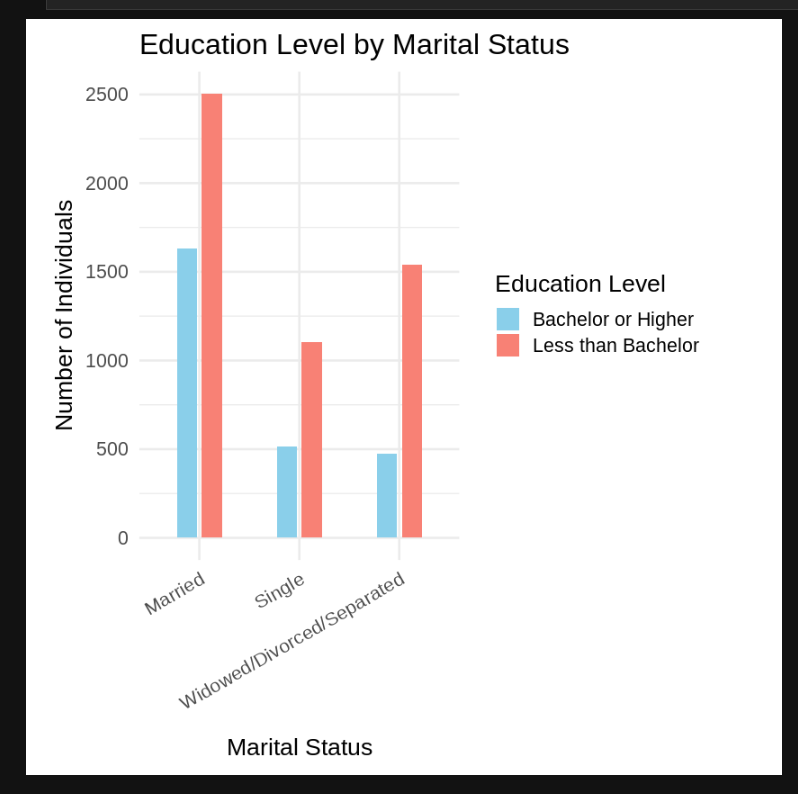

 

Stastical method: Chi Square Test 

✅ Statistically significant association between marital status and education level.

- People who are married are more likely to hold a bachelor’s degree or higher compared to those who are single, divorced, separated, or widowed.

- The analysis of the dataset suggests a positive association between education level and marital status.
  

 

  
2. Marital Status & Mean Sedentary Behavior
  
 

*Note: Location in .ipynb file: `In [25]:`*

**Is there a difference in the mean sedentary behavior time between those who are married and those who are not married?**

`YES - Married people are associated with less sedentary behavior time` (in the sample data)

Variables explored: 
- `DMDMARTZ` (Marital Status)
- `PAD680` (Sedentary Behavior Time)  

 

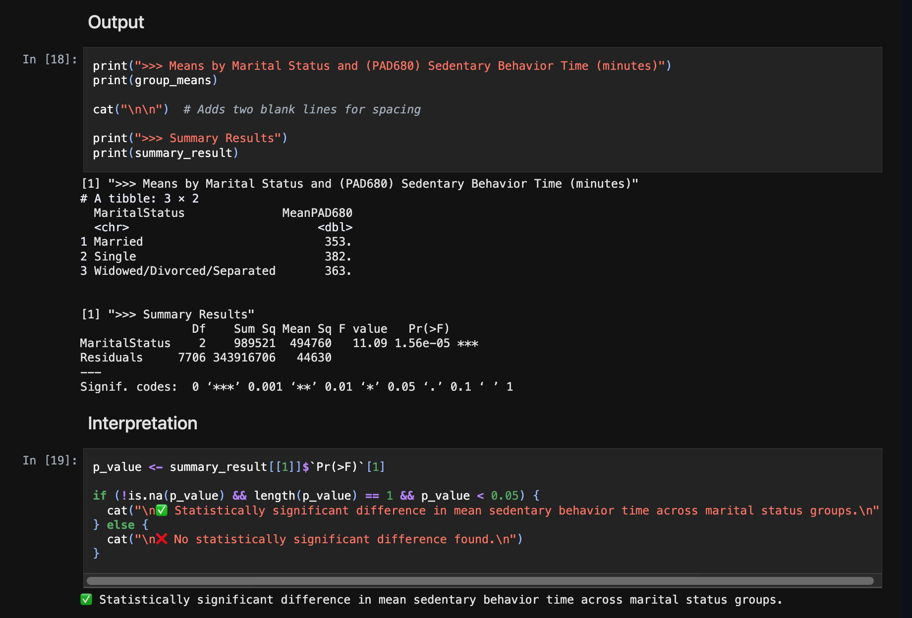

 

Visualization

 

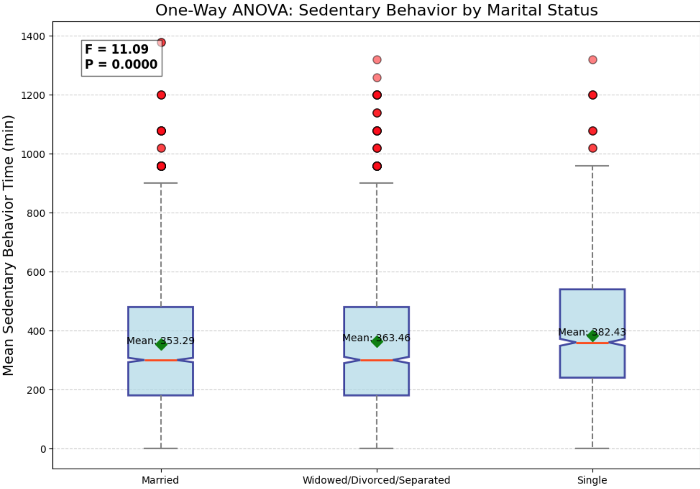

 

Stastical method: One-way Anova

✅ Statistically significant difference in mean sedentary behavior time across marital status groups.

- The analysis revealed a statistically significant variation in average sedentary time across different marital status groups. 

- Single individuals recorded the highest average sedentary time (382.43 minutes), followed by those who were widowed, divorced, or separated (363.46 minutes), while married individuals had the lowest (353.29 minutes). 

- The result suggests that marital status may be associated with differences in sedentary behavior (single people are more likely to engage in sedentary behavior than those who are married or widowed/divorced/separated.)

 

  
3. Marital Status & BP Systolic 
  
 

*Note: Location in .ipynb file: `In [31]:`*

**How do age and marital status affect systolic blood pressure?**

`Single people have lowest SBP. followed by married people, with  widowed, divorced, or separated with highest SBP` (in the sample data)

Variables explored: 
- `RIDAGEYR` (Age)
- `DMDMARTZ` (Marital Status) 
- `BPXOSY3` (Systolic BP)  

 

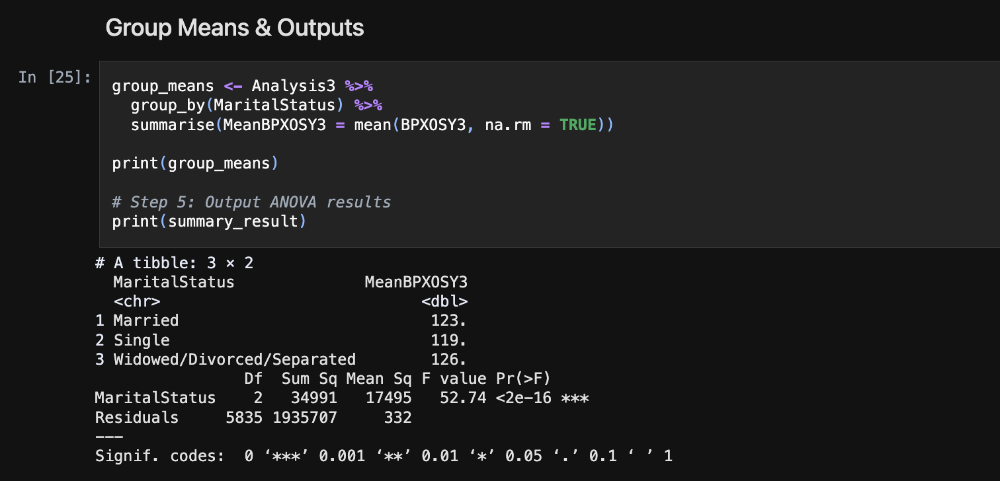

 

Visualization

 

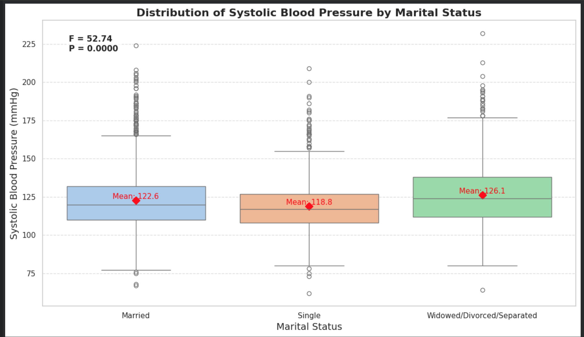

 

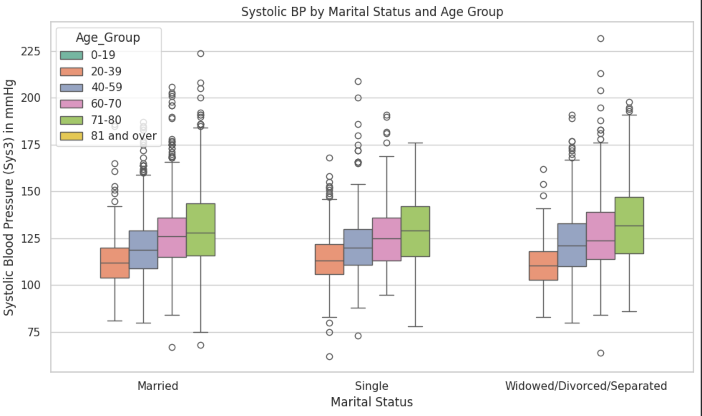

 

Stastical method: One-way Anova

✅ Statistically significant difference in systolic blood pressure across marital status groups.

- The analysis showed a statistically significant difference in average systolic blood pressure among marital status groups. 

- Individuals who were widowed, divorced, or separated had the highest average (126.1 mmHg), followed by married individuals (122.6 mmHg), while single individuals had the lowest (118.8 mmHg). 

- These findings suggest that marital status may be related to differences in blood pressure levels.

 

  
4. Weight & Sedentary Behavior
  
 

*Note: Location in .ipynb file: `In [43]:`*

*Avoidable use of `pd.set_option('display.max_rows', None)` in `In [44]:`, `In [48]:` & `In [55]:` displays the full CSV file in the .ipynb file on Github.*

**Is there a correlation between self-reported weight and minutes of sedentary behavior?**

`Very weak correlation` (in the sample data)

Variables explored: 
- `WHD020` (Weight) 
- `PAD680` (Sedentary Behavior Time)  

 

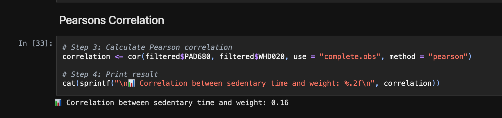

 

Visualization

 

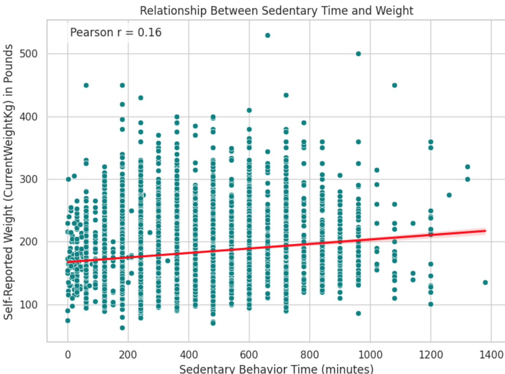

 

Stastical method: Pearsons correlation

✅ Statistically significant association between marital status and depressive symptoms.

- The correlation between sedentary time and self-reported weight was 0.16, showing a very weak positive relationship. 

- This means that people who spend more time being sedentary tend to have slightly higher weights (there could be other variables at play as well; though dedebtary lifestyle y itself, ignoring all other factors, tends to in increase weight).

 

  
5. Marital Status & Depression
  
 

*Note: Location in .ipynb file: `In [53]:`*

**Is there an association between marital status and frequency of depressive symptoms?**

`YES: Strong association, with marriage appearing protective and non-married statuses associated with higher symptom burden ` (in the sample data)

Variables explored: 
- `DMDMARTZ` (Marital Status) 
- `DPQ020` (Depressive Symptoms Frequency) 

 

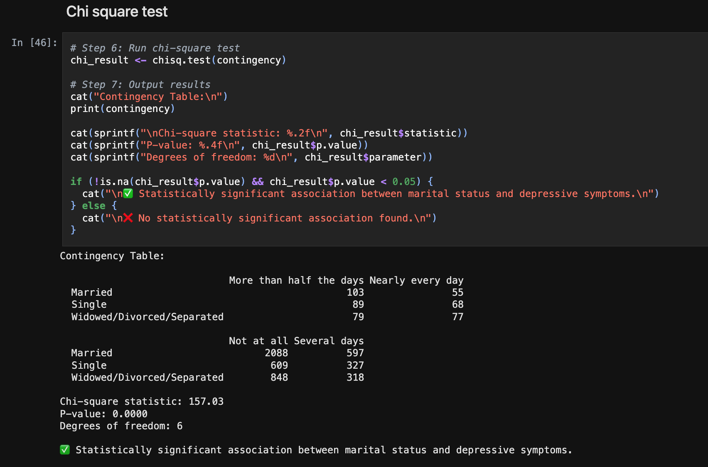

 

Visualization

 

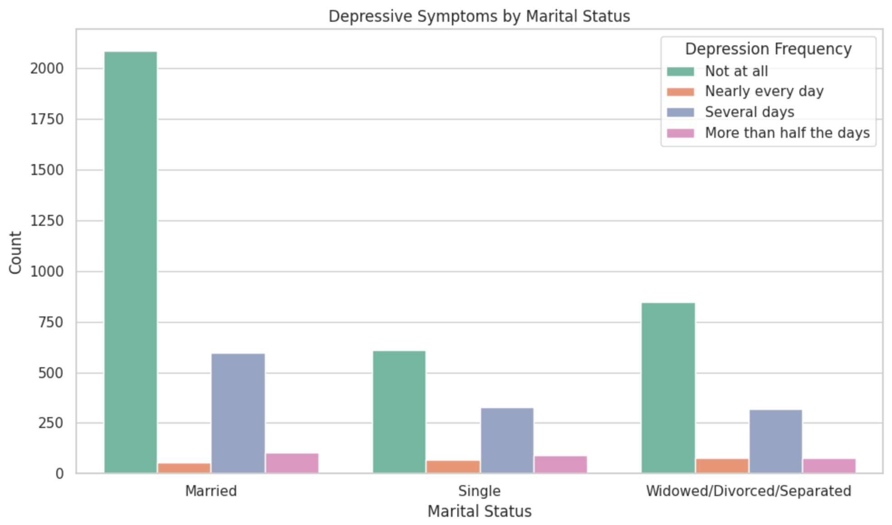

 

Statistical method: Chi Square test

✅ Statistically significant association between marital status and depressive symptoms.

- There is a strong, statistically significant association between marital status and reported depressive symptoms in this sample. Married people report “Not at all” depressive symptoms most often, while single and widowed/divorced/separated individuals show relatively higher frequencies of depressive symptoms.

- The visual pattern and chi-square test indicate that marital status is meaningfully related to how often people experience depressive symptoms, with marriage appearing protective and non-married statuses associated with higher symptom burden in this dataset

 
